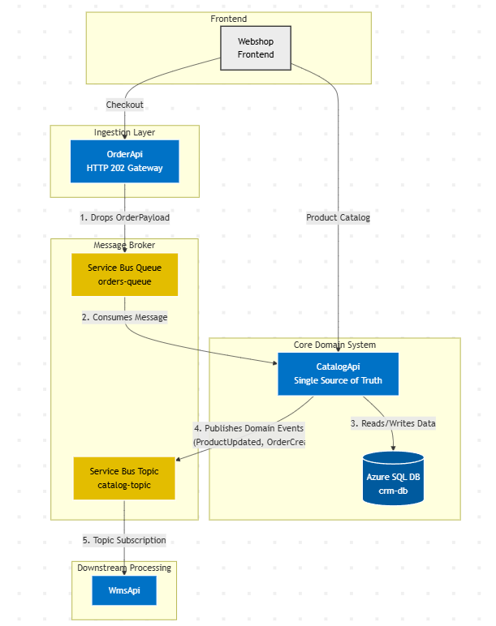

# E-Commerce Integration Pipeline

An event-driven e-commerce integration application built to explore Azure Functions, asynchronous messaging, and domain events. The architecture separates checkout ingestion from core order and catalog processing, with a downstream Warehouse Management System (WMS) consumer receiving events through Azure Service Bus.

## Architecture Overview

*   **Webshop Frontend:** Sends checkout requests to OrderApi and retrieves the product catalog directly from CatalogApi. The frontend is shown in the architecture diagram; its implementation is not included in this repository.
*   **Ingestion Layer — OrderApi (Azure Functions):** Accepts HTTP order payloads containing `OrderId`, `CustomerEmail`, and `TotalAmount`. Checks that `OrderId` is present, sends the payload to `orders-queue`, and returns **HTTP 202 Accepted** for asynchronous processing.
*   **Message Broker (Azure Service Bus):** Uses `orders-queue` to buffer incoming orders and `catalog-topic` to distribute domain events to downstream subscribers.
*   **Core Domain System — CatalogApi (Azure Functions):** Acts as the single source of truth for catalog and order data. Consumes queued orders, persists them to SQL, exposes HTTP endpoints for product operations, and publishes domain events such as `OrderCreated` and `ProductUpdated`.
*   **Data Store (Azure SQL Database):** Stores products, categories, product-category relationships, and orders in `crm-db`. CatalogApi reads and writes this data through Entity Framework Core.
*   **Downstream Processing — WmsApi (Azure Functions):** Consumes events directly from the `wms-inventory-updates` subscription on `catalog-topic`. The current implementation routes `OrderCreated` events to an order-processing handler and logs order details and other event types as a starting point for warehouse integration.

<p align="center">
  
</p>

### Order and Catalog Flow

1. **Accept checkout:** The webshop submits an order to `POST /api/orders`. OrderApi queues the validated payload and returns HTTP 202; this acknowledges acceptance, not completion of warehouse processing.
2. **Consume the order:** CatalogApi receives the message from `orders-queue` through a Service Bus trigger.
3. **Persist domain data:** CatalogApi saves the order to `crm-db`. Its product endpoints also read and write catalog data, with `GET /api/products` serving the webshop's product catalog.
4. **Publish domain events:** After saving changes, CatalogApi publishes events to `catalog-topic`. Implemented event types are `OrderCreated`, `ProductCreated`, `ProductUpdated`, and `ProductDeleted`.
5. **Process downstream events:** WmsApi receives events through its topic subscription and routes them by event type.

## Technology Stack

*   **Core:** C#, Azure Functions v4 (Isolated Worker Model); OrderApi targets .NET 8, while CatalogApi and WmsApi target .NET 10
*   **Messaging:** Azure Service Bus queues, topics, and subscriptions
*   **Persistence:** Azure SQL Database and Entity Framework Core
*   **Infrastructure as Code (IaC):** Azure Bicep
*   **CI/CD:** GitHub Actions
*   **Testing:** xUnit, Moq

## Repository Structure

```text
├── .github/workflows/deploy-pipeline.yml  # Build, test, and deploy all three APIs
├── images/architechture-updated.png       # Current architecture diagram
├── infra/main.bicep                      # Azure resource definitions
├── src/api/
│   ├── OrderApi/                         # HTTP checkout ingestion and queue output
│   ├── CatalogApi/                       # Core domain processing and product endpoints
│   │   ├── Data/                         # Entity Framework Core database context
│   │   ├── Functions/                    # Product HTTP functions and order queue consumer
│   │   ├── Migrations/                   # Database schema migrations
│   │   └── Models/                       # Product, category, and order entities
│   └── WmsApi/                           # Downstream domain-event subscriber
└── tests/
    ├── OrderApi.Tests/                   # Order API unit test project
    └── WmsApi.Tests/                     # WMS API unit test project
```

## Continuous Integration and Deployment

The GitHub Actions workflow in `.github/workflows/deploy-pipeline.yml` runs on pushes to `main` and defines the following phases:

1. **Build and Test:** Builds OrderApi, CatalogApi, and WmsApi, runs the existing OrderApi and WmsApi unit test projects, and publishes deployment artifacts for all three APIs.
2. **Deploy Infrastructure:** Uses `infra/main.bicep` to provision the three Function Apps, Service Bus queue and topic subscription, Azure SQL, storage, and monitoring resources in `rg-ecommerce-prod`.
3. **Deploy Functions:** Deploys the published packages to their respective Azure Function Apps.
4. **Smoke Test:** Submits a sample order to the deployed OrderApi and checks for HTTP 202 Accepted. This verifies order acceptance; it does not verify downstream database persistence or WMS processing.

The workflow currently installs the .NET 8 SDK, and the Bicep template configures all Function Apps for .NET 8. These settings still need to be aligned with the .NET 10 targets in CatalogApi and WmsApi for deployment of the current code.
